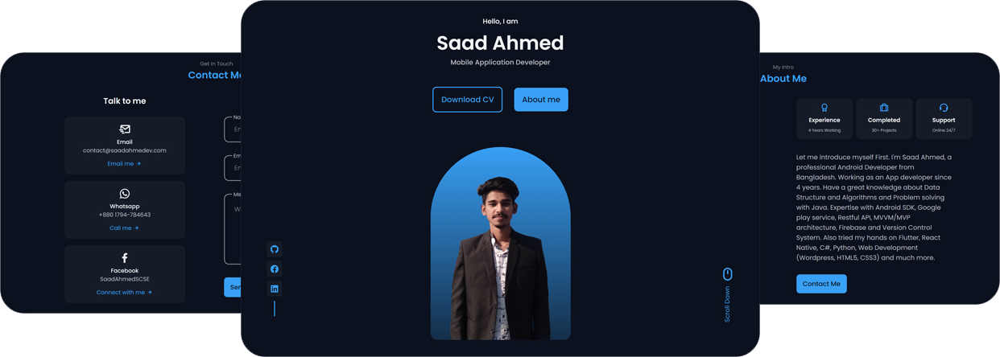
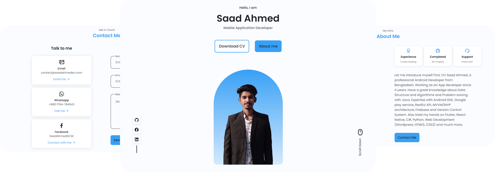

# General
### Responsive Portfolio Website

- Responsive Portfolio Website Using HTML CSS & JavaScript
- Smooth scrolling in each section.
- Includes a dark and light mode.
- Developed first with the Mobile First methodology, then for desktop.
- Compatible with all mobile devices and with a beautiful and pleasant user interface.

# Website
- https://saadahmedev.com/

# Screenshots

